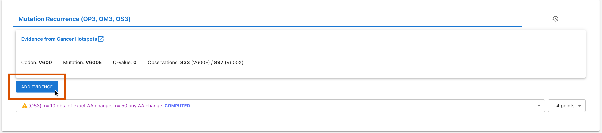
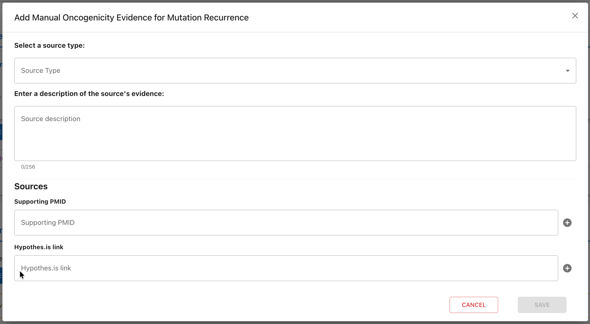
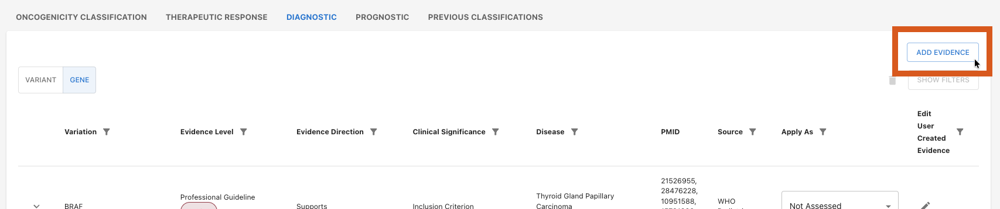
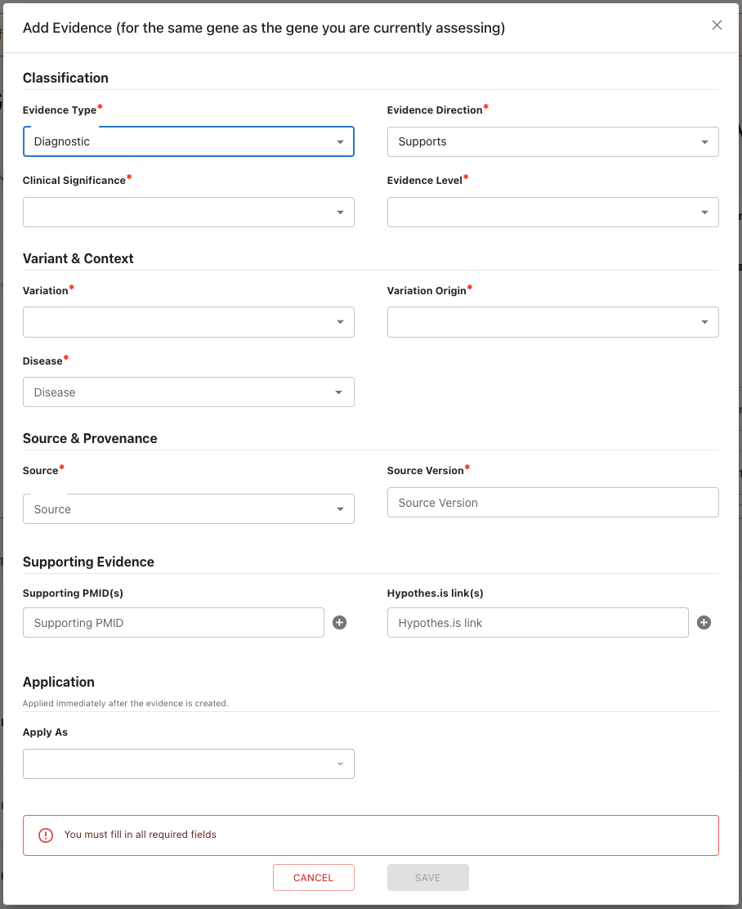

# Adding Evidence Manually
VarCat automatically pulls in evidence from a variety of sources for all assertions. However, assessors may also manually add their own additional evidence if desired.
The following details how to add your own evidence to any assertion.

## Adding Evidence to Oncogenicity Assertions
To add evidence to an oncogenicity assertion, navigate to the sub-section for the relevant evidence type and select the section's "Add Evidence" button:

A pop-up modal will prompt you to enter the information required for the evidence entry. The available fields will depend on the type of evidence you are adding;
but at a minimum, you will always be asked to provide your source for the evidence in the form of PMID(s) and/or Hypothes.is link(s).

The "Save" button will be disabled until all required fields have been filled. When everything is ready, hit "Save" to add this evidence to the assertion.

## Adding Evidence to Non-Oncogenic Assertions

Evidence for all other assertions is added via the "Add Evidence" button in the upper-right corner of the assertion's evidence tab:

The "Add Evidence" modal will display:

Fill out this form section by section as follows: 

### Classification:

| _Field_ | _Purpose_ |
| ------- | --------- |
| **Evidence Type** | The type of assertion this evidence is for. |
| **Evidence Direction** | Whether this evidence **supports** or **refutes** the assertion. |
| **Clinical Significance** | The clinical direction supported by this evidence. |
| **Evidence Level** | The strength of this evidence entry's source. Depending on the selected Evidence Type (i.e., the type of assertion this evidence supports/refutes), some combination of the following options will be available:<ul> <li>**Regulatory Therapeutic:** Approved therapeutic evidence (e.g. FDA drug label, international regulatory organizations).</li><li>**Professional Guideline:** Statement from professional guidelines (e.g. WHO, NCCN, ISSVA, European Leukemia Network, COG, ASCO, other professional societies (e.g. AMP, ACMG)).</li><li>**Clinical Intervention:** Clinical trial or case studies examining the use of a therapeutic drug.</li><li>**Clinical Observation:** Observational study examining the diagnostic (e.g. presence or absence of genomic findings for a tumor type) or prognostic (e.g. outcomes) implications for a tumor type.</li><li>**Preclinical:** Preclinical (in vitro or in vivo) evaluation of model organism or systems.</ul>|
| **Cohort Size** _(`Clinical Intervention` evidence level only)_ | The number of individuals or samples used in the clinical intervention.|

### Variant & Context:

| _Field_ | _Purpose_ |
| ------- | --------- |
| **Variation** | What type of variation this evidence is for (protein, coding, genomic, etc.). |
| **Variation Label** _(`Other` variations only)_ | What type of variation this evidence is for. |
| **Variation Origin** | Whether this evidence is for a **somatic** or **germline** variation. |
| **Disease** | The disease relevant to this evidence. |
| **Drug** _(`Therapeutic Response` only)_ | The drug(s) relevant to this evidence. |
| **Drug Interaction Type** _(`Therapeutic Response` only)_ | How these drugs interact with one another, if more than one drug is listed. |

### Source & Provenance:

| _Field_ | _Purpose_ |
| ------- | --------- |
| **Source** | Where this evidence originated. |
| **Type** _(`NCCN` & `WHO` sources only)_ | Specifies the source's subtype. |
| **WHO Details**  _(`WHO` source only)_ | Details specific to WHO-sourced evidence. Includes the following subfields: <ul><li>**Section:** The WHO section this evidence was pulled from.</li><li>**Tier:** The strength of this WHO evidence.</li></ul> |
| **Source Name** _(`Other` source only)_ | The name of the source. |
| **Source Version** | The version of this source used to create this evidence (e.g., the date the source was published, the edition number of the source, etc.) |

### Supporting Evidence (Optional):

| _Field_ | _Purpose_ |
| ------- | --------- |
| **Supporting PMID(s)** | PMID(s) for sources from which this evidence was drawn. |
| **Supporting Hypothes.is link(s)** | Hypothes.is link(s) for sources from which this evidence was drawn. |

### Application (Optional):

| _Field_ | _Purpose_ |
| ------- | --------- |
| **Apply As** | The way in which this evidence should be applied to the listed assertion. |