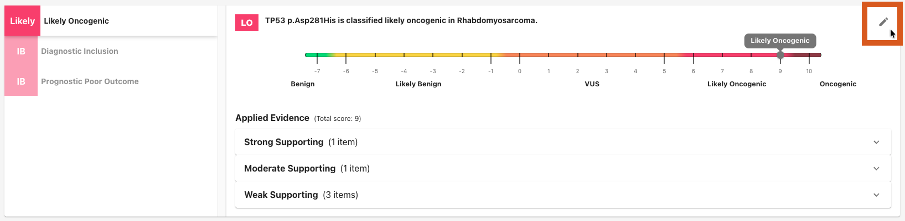

# Tutorial: How to Complete an Assessment

This guide walks through a typical assessment workflow in VarCat.

## 1. Open an Assessment
From the home page, open an assessment by:

- a) Entering a variant + disease pairing in the form shown below, or
- b) Selecting a previously-created assessment from the table

## 2. Change the Status to `Active`
An assessment must be `Active` before you can edit it.

Use the status control in the upper right corner to move through the status lifecycle until you reach `Active`:

Only one user can edit an assessment at a time. If it is currently checked out by another user, you will need to overtake it:

## 3. Review the Oncogenicity Assertion
VarCat creates an initial oncogenicity assertion automatically. Look it over and update it as needed:

### A) Audit Each Section's Evidence

Oncogenicity evidence is organized into sections by type (i.e., [Evidence Lines](./1-concepts.md#evidence-line)). Each Evidence Line section has:

- Any **evidence items** of the titular type
- A **code** indicating the significance of the findings
- A **score** indicating the strength of the findings

Review each evidence section and update it as needed. You can:

- Curate your own additional evidence manually (via the "Add Evidence" button)
- Revise the evidence line's auto-selected code (via the code selection dropdown)
- Change the evidence line's auto-computed score (via the score selection dropdown)
- Review the evidence line's history (on the section's history tab, accessed via the "rewind" icon in the upper-right corner of the section)

### B) Validate the Assertion's Overall Score

The oncogenicity assertion's overall score is the **sum** of all individual sections' scores. However, you may manually override this if necessary by clicking the pencil icon in the upper right-hand corner of the summary modal:

## 4. [Optional] Add or Review Other Assertions
If needed, add or review therapeutic, diagnostic, and/or prognostic assertions.

Use the Summary Modal to view assertions that already exist:

Click the corresponding evidence tab below to work on an existing assertion and/or create a new assertion. If no assertion exists yet for the type of evidence you're viewing, applying the first piece of evidence will create it automatically.

Toggle between variant-level and gene-level evidence where available:

If needed, add new evidence with the **Add Evidence** button.

Apply evidence with the **Apply As** dropdown, if needed.

After evidence is applied, the summary modal updates to reflect the assertion's current state. The assertion's overall classification and score are determined by the **highest ranked** evidence that is currently applied.

You can manually adjust the applied strength for a evidence line grouping from the summary modal.

You can also manually override the classification for the entire assertion as a whole by clicking the pencil icon in the upper right corner of the summary modal, just like Oncogenicity assertions.

## 5. Change the Status to `Awaiting Review`
When the assessment is complete, use the status control button to select "Ready for Review" to update the assessment's status to `Awaiting Review`. Now it's ready for final review and sign-off!

