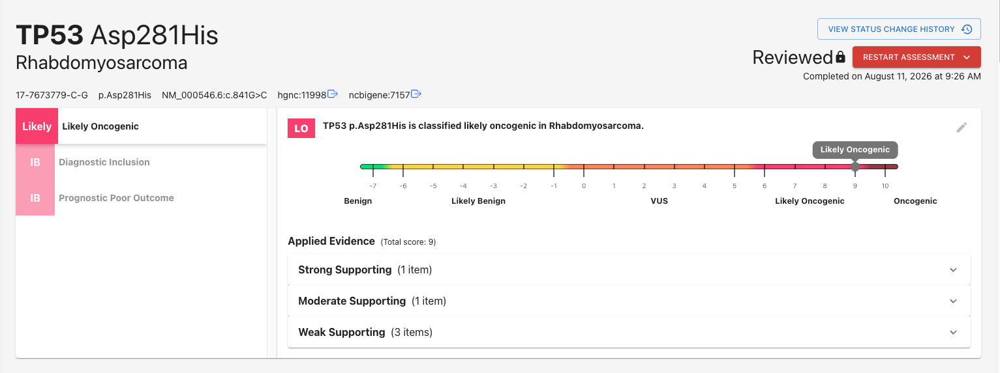

## 1. What's an "assessment?" (and other important terms)
Before we get started, let's define some terminology you'll need to know. 

VarCat is organized into `Assessments` that evaluate specific variant-disease pairings. Each assessment contains several `Assertions` that analyze different aspects of the pairing: 

- **Oncogenicity Assertions:**
    - Oncogenicity Classification
- **AMP/ASCO/CAP Assertions:**
    - Therapeutic Response
    - Diagnostic Inclusion/Exclusion
    - Prognostic Outcome Prediction

For example, an Oncogenicity Classification Assertion for an Assessment of PIK3CA Arg88Gln + Pilocytic Astrocytoma might be: "_PIK3CA p.Arg88Gln is classified **oncogenic** in Pilocytic Astrocytoma."_

Assertions are supported by `Evidence Lines`. These represent evaluations of how a given set of `Evidence` items is interpreted to build an argument for or against the Assertion. Evidence Lines report both the _strength_ and _direction_ of such an argument. For example, an Evidence Line may report a set of gnomAD allele frequency data about HRAS:c.173C>T to provide _moderate_ evidence _supporting_ a proposition that it causes Costello Syndrome.

Assertions must be supported by 1 or more Evidence Lines, which in turn must have 1 or more Evidence items.

## Example
TODO

### Glossary of Terms:
| _Term_ | _Definition_ |
| ---- | ---------- |
| **Assessment** | An evaluation of a variant-disease pairing. |
| **Assertion** | An appraisal of one aspect of a given variant-disease pairing. Each Assessment contains one or more of the following Assertions: _Oncogenicity Classification,_ _Therapeutic Response,_ _Diagnostic evaluation,_ and/or _Prognostic evaluation._ |
| **Evidence Line** | A group of related **Evidence** items that support or refute an **Assertion.** |
| **Evidence** | A proven fact. |

## Understanding an Assessment

At the top of each Assessment is a summary section. Take a look at this summary section for an Assessment of TP53 Asp281His/Rhabdomyosarcoma:

On the left we see a tab list of all the Assertions applied to the Assessment. In this case, we have 3: an Oncogenicity Classification, a Diagnostic Evaluation, and a Prognostic Evaluation. The Oncogenicity Classification is currently selected, displaying the Assertion's:

- **Classification**: _"TP53 p.Asp281His is classified **likely oncogenic** in Rhabdomyosarcoma"_
- **Score**: As displayed by the sliding scale, this variant/disease pairing is scored as a `9` on a scale of `-7` to `10`, which falls in the category of "likely oncogenic."
- **Applied Evidence**: A summarized list of all the evidence supporting this Assertion's classification, grouped by strength.