# Tutorial

[DELETE] /17-7673779-C-G/ncit:C3359

## Overview
The Variation Categorizer (VarCat) is designed to help with somatic variant prioritization and interpretation by utilizing the ClinGen/CGC/VICC Oncogenicity SOP and AMP/ASCO/CAP guidelines to evaluate **oncogenicity**, **therapeutic response**, **prognostic evidence**, and **diagnostic evidence** for various variant/disease pairings. It is intended to assess SNVs and less complex forms of variation in accordance with the ClinGen/CGC/VICC Oncogenicity guidelines.

The following is a guide outlining how to utilize VarCat to complete such an evaluation.

## Completing an Assessment
The following walkthrough details how to create or edit an Assessment for a variant/disease pairing.

### 1. Open an Assessment:
From the homepage, open an Assessment by either:

  - a) Selecting an Assessment from the list, or 
  - b) Entering any variant/disease pairing of your choosing in the selection form above the table.

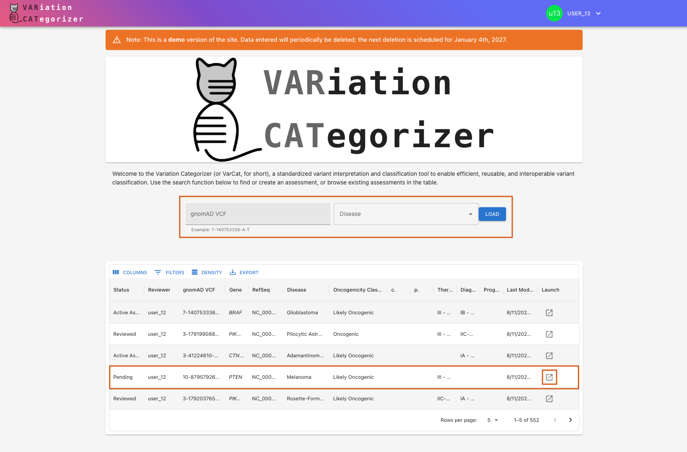

### 2. Change the Assessment's Status to `Active`:

In order to be able to edit an Assessment, you must set its status to `Active`. You may do so via the status button located in the upper-right hand corner. Depending on the Assessment's current status, you may need to update it several times to cycle through the various stages before reaching "Active:"

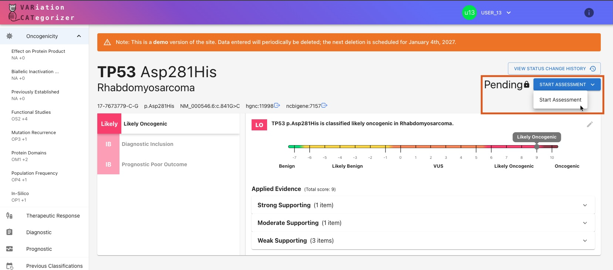

If the Assessment is _already_ active, but checked out to someone else, you will need to overtake the Assessment from them:

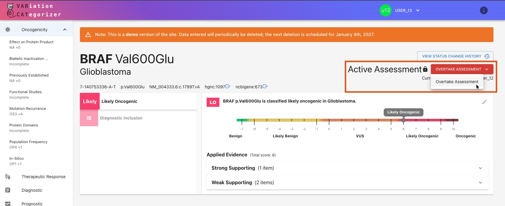

### 3. Examine & Edit the Auto-Computed Oncogenicity Assertion:
VarCat automatically pulls in data from a variety of sources and use this evidence to auto-generate an initial Oncogenicity Assertion for the Assessment. An overview of this Assertion is found at the top of the page in the **summary modal**:

#### Summary Modal:

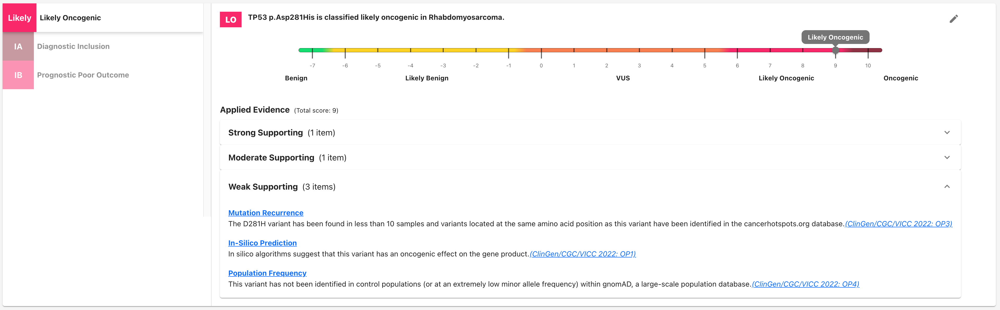

This summary modal contains some high-level info about the Assertion, including:

- **Classification**: _"TP53 p.Asp281His is classified **likely oncogenic** in Rhabdomyosarcoma"_
- **Score**: As displayed by the sliding scale, this variant/disease pairing is scored as a `9` on a scale of `-7` to `10`, which falls in the category of "likely oncogenic."
- **Applied Evidence**: An expandable list of all the evidence supporting this Assertion's classification. For Oncogenicity Assertions, these are grouped and sorted by strength.

#### Evidence Sections:
Beneath the summary modal is a tab displaying all of the evidence to support this Oncogenicity Assertion as required by the [ClinGen/CGC/VICC Oncogenicity Standard Operating Procedure](https://cancervariants.org/research/standards/onc_path_sop/). Evidence is grouped into sections by type, and each section receives a **code** to denote its significance, as well as a **score** that indicates the _strength_ and _direction_ of the data in that section. 

For example, take a look at the first evidence section ("Effect on Protein Product") of our TP53 p.Asp281His/Rhabdomyosarcoma Assessment's Oncogenicity Assertion:

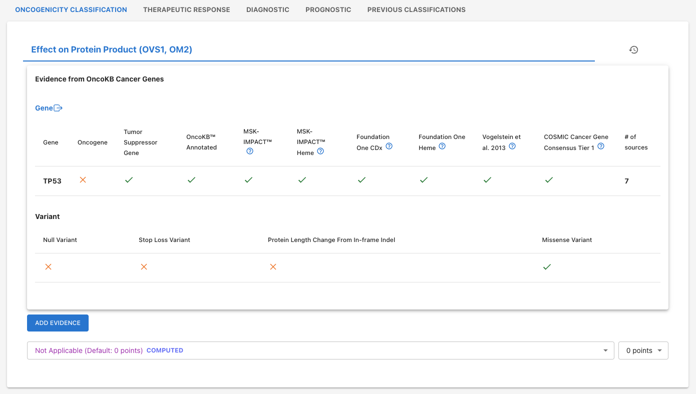

Notice that VarCat has selected a code of "Not Applicable", and a score of `0` for this section. However, you can change both of these using the dropdown menus if you wish. You may also manually add evidence of your own to this section, via the "Add Evidence" button. 

Scroll through the Assertion to view the sections for other types of evidence, or use the left-hand Table of Contents menu to jump to specific sections.

The Assertion's overall score (displayed in the summary modal above) is the sum total of each individual sections' scores. 

### 4. [Optional] Add Additional Assertions:
In addition to the required Oncogenicity Assertion, all Assessments may optionally include one or more additional Assertions following the [AMP/ASCO/CAP](https://pubmed.ncbi.nlm.nih.gov/27993330/) guidelines.

To view an Assertion that's already been created, click on the corresponding tab in the Summary Modal:

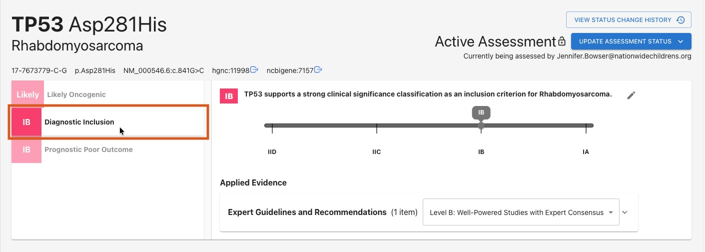

To add or edit the Assertion's evidence, or to create a new Assertion, click on the appropriate tab beneath the summary modal:

Here you'll see a list of evidence that's relevant to this Assessment's **variant**, or its **gene.** Toggle back and forth between these views using the toggle at the top of the chart:

VarCat will automatically pull in evidence from a variety of sources that will auto-populate these tables where possible. You may also manually curate evidence by selecting the "Add Evidence" button in to the upper right of the table, and filling in the curation form:

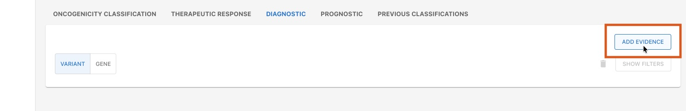

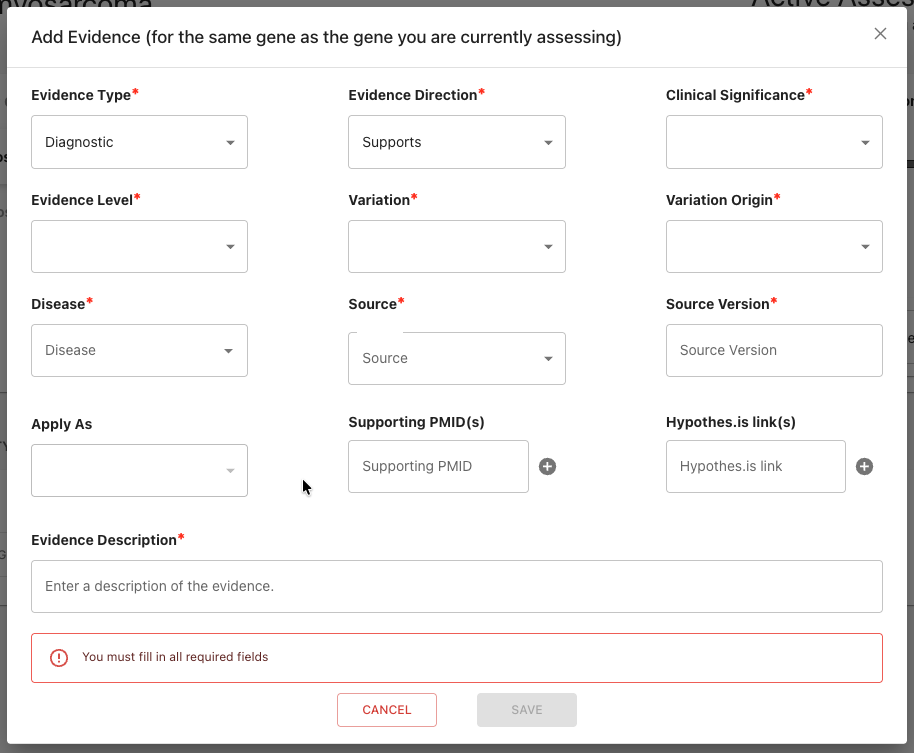

Once you've selected or created the evidence you'd like to use, apply it to the Assertion by using the dropdown in the "Apply As" column (unless you created the entry yourself and already applied it during creation):

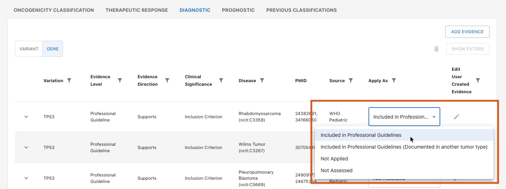

Notice that the Summary Modal updates to display the newly-applied evidence, grouped by **type** (note: you may need to refresh the page). The Assertion's **score** and **classification** will auto-update based on the evidence you apply and how you apply it.

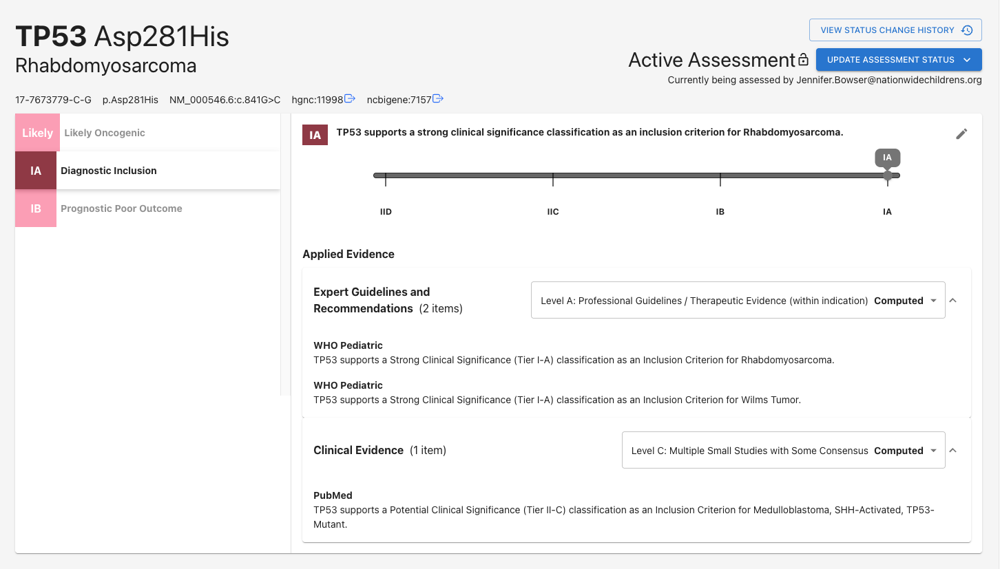

To upgrade or downgrade all evidence in a category, use the dropdown options in the summary modal:

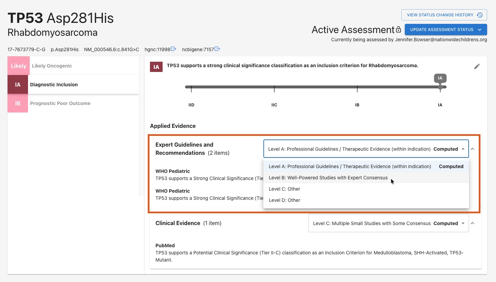

You will be asked to provide a rationale for your decision: 

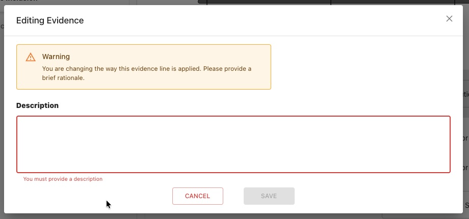