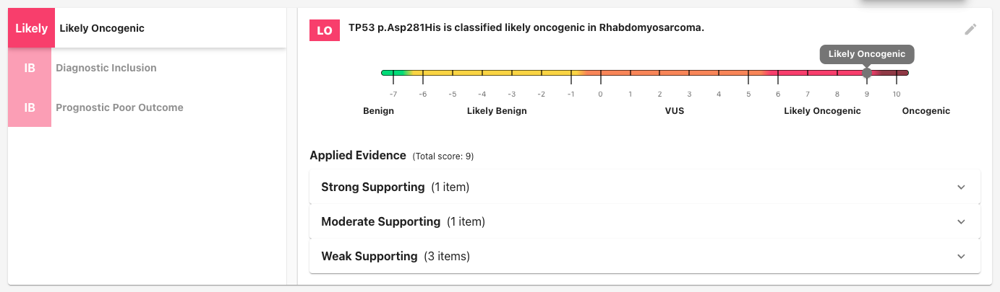
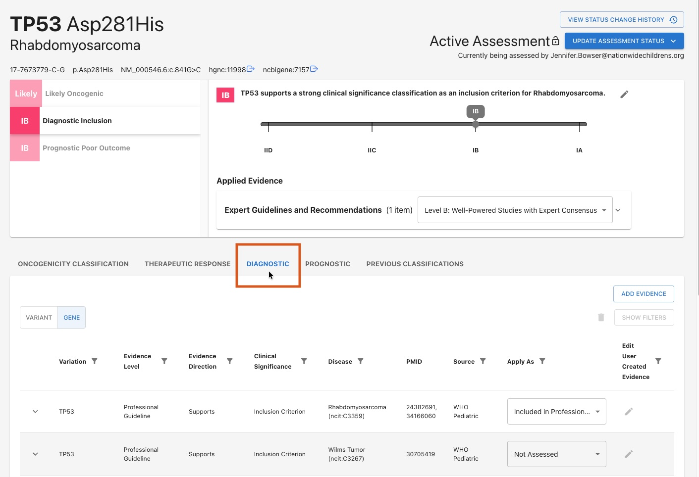
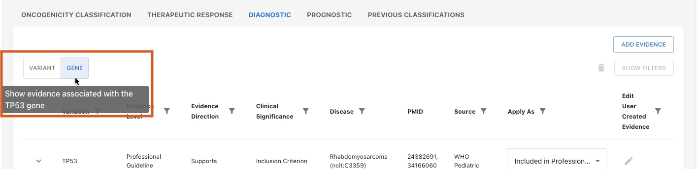
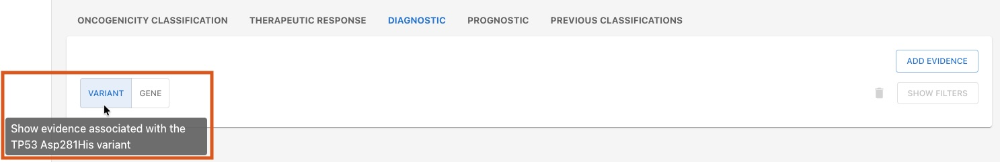

# Tutorial

[DELETE] /17-7673779-C-G/ncit:C3359

## Overview
The Variation Categorizer (VarCat) is designed to help with somatic variant prioritization and interpretation by utilizing the ClinGen/CGC/VICC Oncogenicity SOP and AMP/ASCO/CAP guidelines to evaluate **oncogenicity**, **therapeutic response**, **prognostic evidence**, and **diagnostic evidence** for various variant/disease pairings. It is intended to assess SNVs and less complex forms of variation in accordance with the ClinGen/CGC/VICC Oncogenicity guidelines.

The following is a guide outlining how to utilize VarCat to complete such an evaluation.

## Terms to Know

### Assessments and Assertions
VarCat is organized around `Assessments` that evaluate specific variant-disease pairings. Each assessment contains several `Assertions` that analyze different aspects of the pairing using the following standardized guidelines: 

- **ClinGen/CGC/VICC Oncogenicity Guidelines:**
    - Oncogenicity Classification
- **AMP/ASCO/CAP Guidelines:**
    - Therapeutic Response
    - Diagnostic Inclusion/Exclusion
    - Prognostic Outcome Prediction

For example, an Oncogenicity Classification Assertion for an Assessment of **TP53 Asp281His** + **Rhabdomyosarcoma** might be: _"TP53 p.Asp281His is classified **likely oncogenic** in Rhabdomyosarcoma."_ A Diagnostic Assertion for the same variant/disease pairing might be: _"TP53 supports a **strong clinical significance** classification as an **inclusion** criterion for Rhabdomyosarcoma."_

Each assessment _must_ contain an Oncogenicity assertion, and may optionally include one or more AMP/ASCO/CAP assertions as well.

### Evidence and Evidence Lines
Each Assertion is supported by `Evidence`. Evidence items that support/refute the same concept are grouped together into `Evidence Lines`. All Evidence items under a given Evidence Line are evaluated together, and the Evidence Line's overall _strength_ and _directionality_ are applied to the Assertion under one score. For example, an Evidence Line may report a set of gnomAD allele frequency data about TP53 p.Asp281His to provide _moderate_ evidence _supporting_ a proposition that it causes Rhabdomyosarcoma.

VarCat automatically pulls in evidence from a variety of sources and computes an automated score for each relevant Evidence Line. Assessors can manually apply/un-apply evidence as needed, as well as adjust the weight and directionality for these scores. They can also add their own evidence if they want to include data from sources outside of those that VarCat pulls in on its own.

### Glossary
| _Term_ | _Definition_ |
| ---- | ---------- |
| **Assessment** | An evaluation of a variant-disease pairing. |
| **Assertion** | An appraisal of one aspect of a given variant-disease pairing. Each Assessment contains an _Oncogenicity Classification,_  plus one or more of the following Assertions: _Therapeutic Response,_ _Diagnostic evaluation,_ and/or _Prognostic evaluation._ |
| **Evidence Line** | A group of related **Evidence** items that support or refute an **Assertion.** |
| **Evidence** | A proven fact. |

## Completing an Assessment

### 1. Open an Assessment:
From the homepage, choose any Assessment from the list, or enter any variant/disease pairing of your choosing in the selection form above.

### 2. Change the Assessment's Status to `Active`:
The status button is located in the upper-right hand corner. Depending on the Assessment's current status, you may need to update it several times to cycle through the various stages before reaching "Active:"

If the Assessment is _already_ active, but checked out to someone else, you will need to overtake the Assessment from them:

### 3. Examine & Edit the Auto-Computed Oncogenicity Assertion:
VarCat automatically pulls in data from a variety of sources and use this evidence to auto-generate an initial Oncogenicity Assertion for the Assessment. An overview of this Assertion is found at the top of the page in the **summary modal**:

#### Summary Modal:

This summary modal contains some high-level info about the Assertion, including:

- **Classification**: _"TP53 p.Asp281His is classified **likely oncogenic** in Rhabdomyosarcoma"_
- **Score**: As displayed by the sliding scale, this variant/disease pairing is scored as a `9` on a scale of `-7` to `10`, which falls in the category of "likely oncogenic."
- **Applied Evidence**: An expandable list of all the evidence supporting this Assertion's classification. For Oncogenicity Assertions, these are grouped and sorted by strength.

#### Evidence Sections:
Beneath the summary modal is a tab displaying all of the evidence to support this Oncogenicity Assertion as required by the [ClinGen/CGC/VICC Oncogenicity Standard Operating Procedure](https://cancervariants.org/research/standards/onc_path_sop/). Evidence is grouped into sections by type, and each section receives a **code** to denote its significance, as well as a **score** that indicates the _strength_ and _direction_ of the data in that section. 

For example, take a look at the first evidence section ("Effect on Protein Product") of our TP53 p.Asp281His/Rhabdomyosarcoma Assessment's Oncogenicity Assertion:

Notice that VarCat has selected a code of "Not Applicable", and a score of `0` for this section. However, you can change both of these using the dropdown menus if they wish. You may also manually add evidence of their own to this section, via the "Add Evidence" button. 

Scroll through the Assertion to view the sections for other types of evidence, or use the left-hand Table of Contents menu to jump to specific sections.

The Assertion's overall score (displayed in the summary modal above) is the sum total of each section's individual scores. 

### 4. [Optional] Add Additional Assertions:
In addition to the required Oncogenicity Assertion, all Assessments may optionally include one or more additional Assertions following the [AMP/ASCO/CAP](https://pubmed.ncbi.nlm.nih.gov/27993330/) guidelines.

To view an Assertion that's already been created, click on the corresponding tab in the Summary Modal:

To add or edit the Assertion's evidence, or to create a new Assertion, click on the appropriate tab beneath the summary modal:

Here you'll see a list of evidence that's relevant to this Assessment's **variant**, or its **gene.** Toggle back and forth between these views using the toggle at the top of the chart:

VarCat will automatically pull in evidence from a variety of sources that will auto-populate these tables where possible. You may also manually curate evidence by selecting the "Add Evidence" button in to the upper right of the table, and filling in the curation form:

Once you've selected or created the evidence you'd like to use, apply it to the Assertion by using the dropdown in the "Apply As" column (unless you created the entry yourself and already applied it during creation):

Notice that the Summary Modal updates to display the newly-applied evidence, grouped by **type** (note: you may need to refresh the page). The Assertion's **score** and **classification** will auto-update based on the evidence you apply and how you apply it.

To upgrade or downgrade all evidence in a category, use the dropdown options in the summary modal:

You will be asked to provide a rationale for your decision: 

